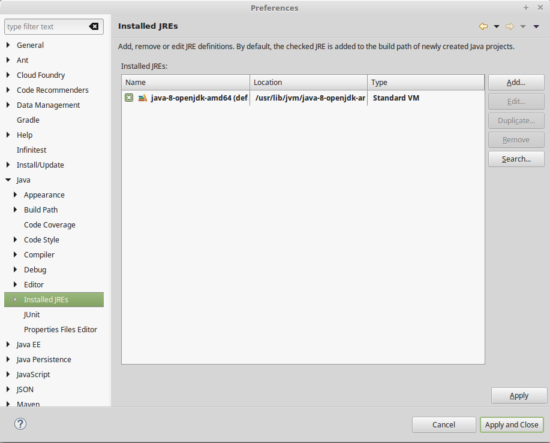

# TP1 : Hello Java
<!-- .slide: data-state="no-toc-progress" class="no-toc-progress" -->
* Introduction to Java development environment
* Object oriented design of a simple Pokemon application
* Writing a simple application that handles Pokemon fights

----

## Hello Java
<!-- .slide: data-state="no-toc-progress" class="no-toc-progress" -->
* Open Eclipse, check JDK configuration
* If needed, some Ensai-specific documentation is available on Moodle : [https://foad-moodle.ensai.fr/course/view.php?id=31](https://foad-moodle.ensai.fr/course/view.php?id=31)  

* Sidequest : explore JDK's content

----

## 1. A first project
<!-- .slide: data-state="no-toc-progress" class="no-toc-progress" -->
* Create a new Java project
* Using windows file explorer, open projects folder
* What does each file / folder do ?

----

## 2. Hello world
<!-- .slide: data-state="no-toc-progress" class="no-toc-progress" -->  
Make sure to follow the naming conventions listed [here](https://www.javatpoint.com/java-naming-conventions)
* Create a new class Main containing a main method
* Within the main method, display "Hello world" to the console
* Run the application, check the console, enjoy

----

## 3. Let's design
<!-- .slide: data-state="no-toc-progress" class="no-toc-progress" -->  
Before programming, it's important to design the classes. Our app will respect the following specifications :
* Each Pokemon belongs to a Species (e.g : Bulbasaur, Charmander ...). A species has the following caracteristics : a number, a name and a type (GRASS, FIRE, WATER)
* There can be multiple Pokemon of a same Species (e.g : multiple Bulbasaur). Each Pokemon has it's own set of attributes : an unique identifier (an Integer starting from 0 and incrementing by 1 for each Pokemon), a surname (immutable), a size (in inches, may be decimal), a level. A Pokemon starts at level 1. The maximum level is set at 5.

  
<br />
=> Create the classes diagram corresponding to the previous specifications

----

## 4. Let's implement !
<!-- .slide: data-state="no-toc-progress" class="no-toc-progress" --> 
* Create a "core" package that will contain the classes corresponding to the previous design
* Create the classes
* Within Main class, instanciate your first Pokemon. You are free to give it any caracteristics you want
* Display its caracteristics to the console
* Sidequest : Within Pokemon class, write the [toString()](https://docs.oracle.com/javase/8/docs/api/java/lang/Object.html) that will generate a String representation of the Pokemon's state

----

## 5. And ... action !
<!-- .slide: data-state="no-toc-progress" class="no-toc-progress" --> 
Pokemons are now able to gain experience points (XP)
* Add a XP attribute to Pokemon
* Write a new receiveXP() method inside Pokemon. This method requires the amount of XP as parameter
* Edit the main function to make your Pokemon receive XP 100 times (i.e. 100 times 1 point). Display the state of the Pokemon between each gain
* Pokemons may now eat sweets in order to gain more experience. The XP boost depends on the sweet that is eaten. A Sweet contains both a name and the amount of XP it gives
* Write the eatSweet() method. This method requires a Sweet as parameter and increases the Pokemon's XP
* Edit the main function to let your Pokemon eat some sweet sweets
* Sidequest : A sweet can only be eaten one time. After the first time, it doesn't give XP anymore

----

## 6. More action
<!-- .slide: data-state="no-toc-progress" class="no-toc-progress" --> 
Pokemons are now ready to fight !
* Add an health point (HP) and strength attribute to Pokemon. Starting HP and strength are determined only by the species of the Pokemon but may vary afterwards
* Create an attack() function. This function takes the Pokemon to fight as parameter. When a Pokemon attacks, it deals damage equals to its strength to the other Pokemon
* Within the main function, run a fight between 2 Pokemons. Rules of the fight are simple : each Pokemon attacks the other until one Pokemon becomes KO (KO when HP <= 0)
* Whenever a Pokemon wins a fight, it receives 5 XP

----

## 7. Next level
<!-- .slide: data-state="no-toc-progress" class="no-toc-progress" --> 
Currently, Pokemons get XP but their level never changes.  
* Add to the code, wherever you see fit, the following XP requirements :

| Level        |     XP required     |   
| :------------ | -------------: | 
| 1        |     0    |  
| 2      |   5    |  
| 3         |     15      |   
| 4         |     30     |  
| 5        |     100     |  
* Write a function that, given an amount of XP, returns the corresponding level
* Whenever a Pokemon gains XP, make sure it's level is updated accordingly

----

## 8. Adding some RNG (Random Number Generation)
<!-- .slide: data-state="no-toc-progress" class="no-toc-progress" --> 
The code is currently deterministic which is not the most fun. Let's shake this a little
* Using the [Random](https://docs.oracle.com/javase/8/docs/api/java/util/Random.html) class, generate some random caracteristics to spice combat

----

## More food for thought
<!-- .slide: data-state="no-toc-progress" class="no-toc-progress" --> 
* Using the [Scanner](https://docs.oracle.com/javase/8/docs/api/java/util/Scanner.html) class, allow User to choose it's Pokemons caracteristics
* Using Eclipse's export - runnable jar file - menu, export a runnable jar file. Try running it using this command :   
```
java -jar jeanmichel.jar
```  
Congrats, you now have a working Pokemon application \o/